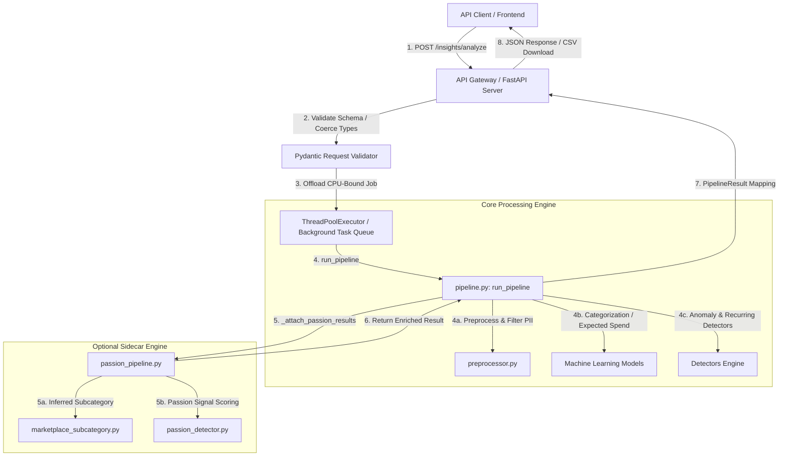

# System Design: Insight Engine REST API

This document provides a comprehensive architectural proposal, scoping analysis, and security evaluation for exposing the **Insight Engine** and **Passion Sidecar** as a secure, production-grade REST API.

---

## 1. Architectural Overview & Data Flow

Currently, the Insight Engine runs as a batch-processing terminal command (e.g., in `demo.py`), consuming CSV files, running ML feature engineering/inference, and saving results to disk. To expose this as a web service, we propose utilizing **FastAPI**, which aligns perfectly with modern Python ML applications due to:
* **High Performance**: Built on Starlette and Uvicorn.
* **Pydantic Validation**: Automatic deserialization, type coercion, and validation of request inputs.
* **Auto-generated Docs**: Out-of-the-box Swagger UI (`/docs`) and ReDoc (`/redoc`).

### High-Level Service Architecture



---

## 2. Potential Flaws, Security Issues & Pain Points

Before writing any API code, we must analyze the vulnerabilities, structural bottlenecks, and data leak vectors associated with exposing scientific/ML data pipelines online.

### A. Event-Loop Blockage (Critical Threading Bottleneck)
> [!WARNING]
> **The Problem:** Python's `async/await` system is single-threaded. If an API handler runs a CPU-intensive pandas operation, CatBoost inference, or a blocking file-read (like loading NLP datasets in `passion_pipeline`'s startup checks) directly within an `async def` function, **the entire server will freeze** and refuse to process other requests until that execution completes.
>
> **The Mitigation:** 
> 1. All heavy CPU/IO work (`run_pipeline`, `train_models`) must be run in a thread pool using FastAPI's built-in `BackgroundTasks` or `asyncio.to_thread`.
> 2. For heavy loads or long-running jobs (large statement files >100k rows), we should implement an **Asynchronous Job Pattern** (Upload CSV -> Return Job ID -> Poll Status -> Download Results).

### B. Denial of Service (DoS) via Memory and Row Bombing
> [!CAUTION]
> **The Problem:** Processing massive CSV files in Pandas creates high peak memory overhead (up to 5x of raw file size due to temporary DataFrames during feature engineering). Multiple concurrent large uploads will result in an **Out of Memory (OOM) Crash** of the container.
>
> **The Mitigation:**
> 1. **Content-Length Limit**: Restrict file upload sizes via middleware (e.g., maximum 10MB per CSV).
> 2. **Row Threshold Limit**: Read the CSV headers and verify the row count before loading the entire dataset into memory. Enforce `INSIGHT_ENGINE_PASSION_MAX_ROWS` (default: 100,000) at the API level.
> 3. **Input Pagination/Chunking**: For very large datasets, enforce processing on a worker node rather than the web server process.

### C. Personal Identifiable Information (PII) Leakage
> [!IMPORTANT]
> **The Problem:** Bank statements are highly sensitive. Narration remarks (`remarks` / `cleaned_remarks`) frequently contain full names, merchant locations, phone numbers, and financial details. If an API crashes or throws an exception, logging raw traceback data or serializing raw bank narration remarks into diagnostic files could violate GDPR, HIPAA, or financial compliance.
>
> **The Mitigation:**
> 1. Strictly utilize the existing `log_safe_merchant` and `log_safe_text` functions from `log_utils.py` across all API loggers.
> 2. Configure `ENABLE_PII_DEBUG_LOGS=false` globally.
> 3. Mask narration remarks in any generated crash-dump files before saving them to the filesystem.

### D. Model Deserialization & RCE (Remote Code Execution)
> [!CAUTION]
> **The Problem:** Python's standard `pickle` module is vulnerable to arbitrary code execution during deserialization. If the API allows uploading custom trained models or states as a parameters vector, a malicious user could execute arbitrary shell scripts on the server.
>
> **The Mitigation:**
> 1. **No User Model Uploads**: Never allow model uploads via the API.
> 2. **Server-Managed Models**: Save and load model states strictly from a pre-defined secure workspace subdirectory on the server, using structured JSON/CSV weights or pre-validated pipelines.

---

## 3. API Specification

We propose exposing two API patterns:
1. **JSON Payload API**: For processing individual transaction streams on the fly (ideal for web/mobile integration).
2. **File Upload API (CSV)**: For batch statement ingestion (ideal for batch processing and user uploads).

### A. Endpoint: `POST /api/v1/insights/analyze/transactions`
Analyze transactions sent directly in a JSON payload.

* **Request Headers**:
  - `Content-Type: application/json`
  - `X-Merchant-Token: <token>` (Authentication token verified via existing `verify_merchant_token` logic)

* **Request Body (JSON)**:
```json
{
  "config": {
    "passion_enabled": true,
    "zscore_threshold": 3.0,
    "pct_dev_threshold": 0.5,
    "known_persons": {
      "MOM": ["mom", "mother"],
      "SELF_HDFC": ["hdfc", "self transfer"]
    }
  },
  "transactions": [
    {
      "date": "2026-05-15",
      "amount": 1200.50,
      "amount_flag": "debit",
      "remarks": "SAFEWAY STORE 1024"
    },
    {
      "date": "2026-05-16",
      "amount": 50000.00,
      "amount_flag": "credit",
      "remarks": "SALARY ACME INC"
    }
  ]
}
```

* **Success Response (200 OK)**:
```json
{
  "run_id": "run_a4b9c8d7e6f5",
  "status": "success",
  "exclusion_stats": {
    "total_transactions": 2,
    "excluded_transactions": 0,
    "exclusion_rate": 0.0,
    "raw_global_mean": 1200.5,
    "filtered_global_mean": 1200.5
  },
  "insights": [
    "Recurring payment to ACME INC detected.",
    "Higher than normal grocery spend at SAFEWAY STORE."
  ],
  "passion_insights": [
    "Active interest in Culinary arts and Groceries detected."
  ],
  "passion_signals": [
    {
      "category": "groceries",
      "spend_share": 1.0,
      "merchant_list": ["SAFEWAY STORE"]
    }
  ]
}
```

---

## 4. API Testing Strategy

To ensure zero regression, we will extend the existing `pytest` architecture by writing integration tests under `tests/test_api.py` covering:
1. **Schema Validation**: Injecting malformed types, missing columns, and empty requests.
2. **Event-Loop Safety**: Firing parallel heavy requests and verifying that the API doesn't hang or timed out.
3. **PII Masking**: Ensuring that raw exception reports and access logs never dump raw remarks.
4. **Token Security**: Testing mock token authentication gates.

---

## 5. Next Steps & Action Plan

Since this requires significant setup (FastAPI, Uvicorn, testing harnesses), we will proceed according to the **[user_global]** workflow:
1. **Obtain user approval** on this system design.
2. If approved, we will create a dedicated checklist in `task.md`.
3. Scaffold `config.py` overrides and Pydantic schema validation.
4. Build the FastAPI router (`app.py` or `api/`).
5. Write core endpoints and integrate the background thread executors.
6. Verify against existing tests and run new API validation test suites.

Please review this system design. Once approved, instruct me to start the implementation!
